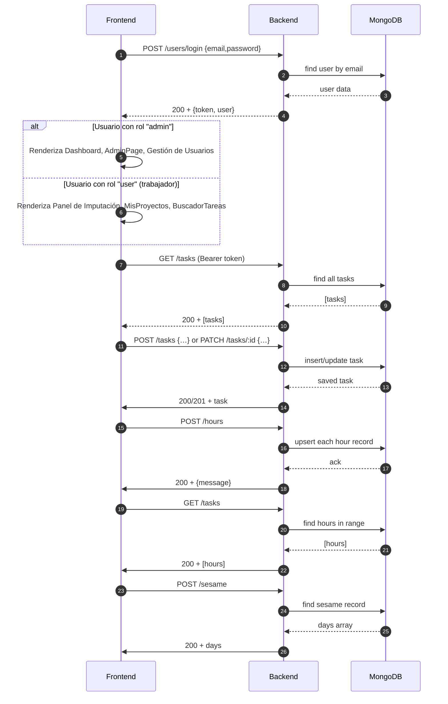

```mermaid
sequenceDiagram
    autonumber
    participant FE as Frontend
    participant BE as Backend
    participant DB as MongoDB

    %% 1. Inicio de sesión
    FE->>BE: POST /users/login {email,password}
    BE->>DB: find user by email
    DB-->>BE: user data
    BE-->>FE: 200 + {token, user}

    %% 1a. Mostrar vistas según rol
    alt Usuario con rol "admin"
        FE->>FE: Renderiza Dashboard, AdminPage, Gestión de Usuarios
    else Usuario con rol "user" (trabajador)
        FE->>FE: Renderiza Panel de Imputación, MisProyectos, BuscadorTareas
    end

    %% 2. Carga de proyectos/tareas
    FE->>BE: GET /tasks (Bearer token)
    BE->>DB: find all tasks
    DB-->>BE: [tasks]
    BE-->>FE: 200 + [tasks]

    %% 3. Crear o actualizar proyecto
    FE->>BE: POST /tasks {…}  or  PATCH /tasks/:id {…}
    BE->>DB: insert/update task
    DB-->>BE: saved task
    BE->>FE: 200/201 + task

    %% 4. Imputar horas
    FE->>BE: POST /hours
    BE->>DB: upsert each hour record
    DB-->>BE: ack
    BE->>FE: 200 + {message}

    %% 5. Leer horas imputadas
    FE->>BE: GET /tasks
    BE->>DB: find hours in range
    DB-->>BE: [hours]
    BE->>FE: 200 + [hours]

    %% 6. Días trabajados (Sesame)
    FE->>BE: POST /sesame
    BE->>DB: find sesame record
    DB-->>BE: days array
    BE->>FE: 200 + days

```
